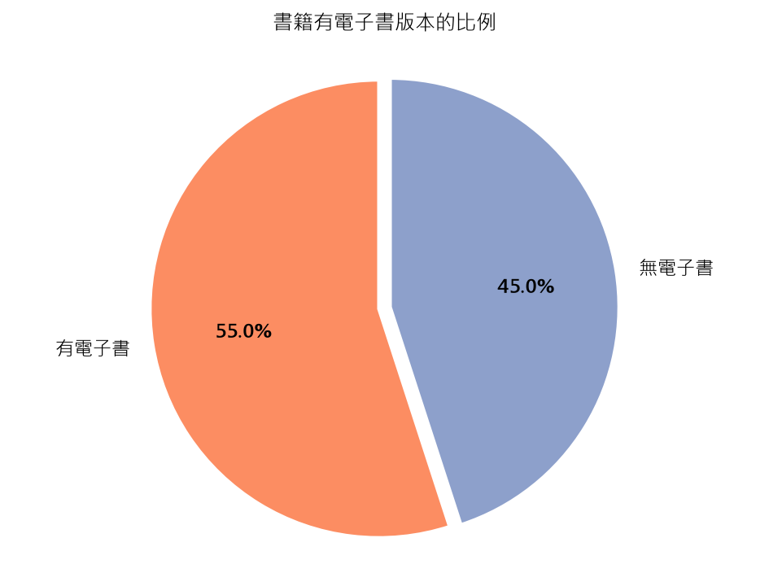
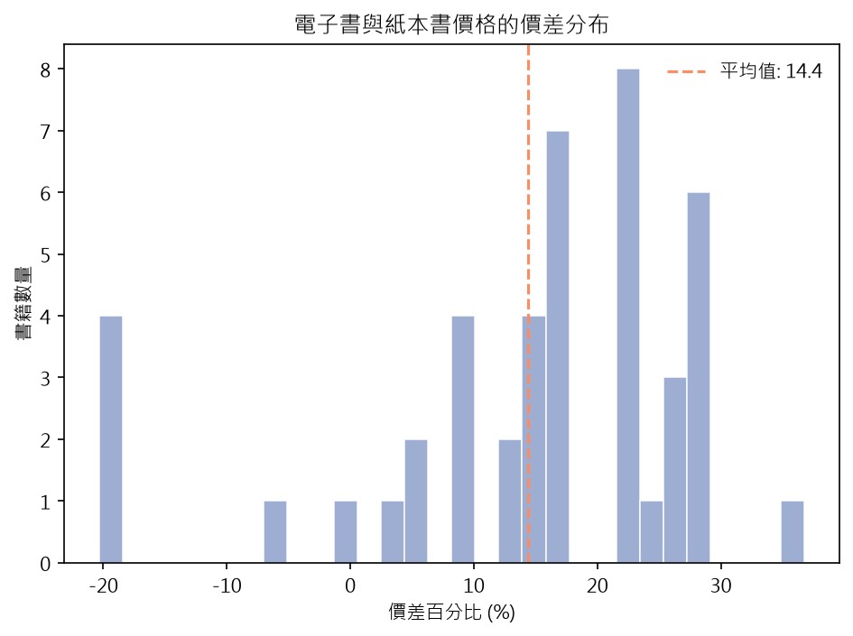
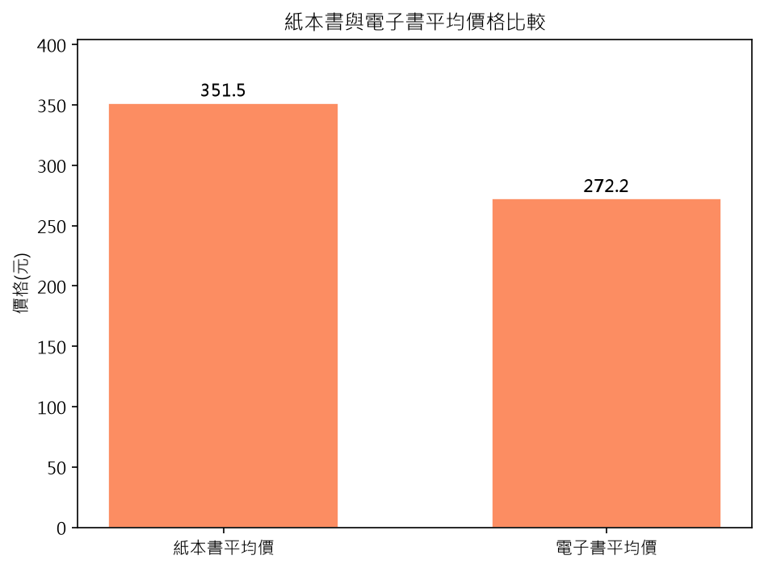

# 紙本書 vs 電子書價格比較分析

爬取線上書局的中文書月排行榜前 100 名，比較同一本書的紙本與電子書價格，並用統計與圖表回答「電子書真的比較便宜嗎？」

## 專案動機

市面上普遍認為電子書比紙本書便宜，但很少看到具體數據驗證。本專案以暢銷排行榜書籍為樣本，貼近讀者實際購書情境，用資料檢驗這個印象是否成立。

## 研究問題

1. 暢銷書中，有電子書版本的比例是多少？
2. 紙本與電子書的平均價格差多少？
3. 是否所有電子書都比紙本便宜？有沒有反例？

## 主要發現

- 55% 的書籍有電子書版本，45% 僅有紙本
- 紙本書平均價格略高於電子書
- 多數電子書比紙本便宜，價差集中在 10%～30%
- 仍有 6 本書的電子書價格反而高於紙本，顯示定價並非一律「電子書較便宜」





## 使用工具

| 用途 | 工具 |
|---|---|
| 網頁爬蟲 | Playwright |
| 資料處理 | pandas、numpy |
| 視覺化 | matplotlib |

## 系統架構

```
線上書局月排行榜
      │
      ▼
scrapers/book_scraper.py     Playwright 爬取紙本排行榜，再取得書本價格
      │
      ▼
data/raw/books_combined.csv  原始資料
      │
      ▼
cleaning/clean_data.py       缺漏值處理、調整資料型態、計算價差
      │
      ▼
data/processed/comparison_result.csv
      │
      ├──► analysis/stats.py       統計數字摘要
      └──► analysis/visualize.py   圖表輸出至 output/
```

## 專案結構

```
.
├── config.example.py        設定檔範本（複製為 config.py 使用）
├── main.py                  主程式：爬蟲 → 清理 → 統計 → 視覺化
├── scrapers/
│   └── book_scraper.py
├── cleaning/
│   └── clean_data.py
├── analysis/
│   ├── stats.py
│   └── visualize.py
├── data/
│   ├── raw/
│   └── processed/
├── output/
└── docs/images/             README 使用的圖片
```

## 安裝與執行

環境需求：Python 3.10 以上

```bash
pip install -r requirements.txt
playwright install chromium
```

複製設定檔並填入目標網站的網址：

```bash
# Windows
copy config.example.py config.py

# macOS / Linux
cp config.example.py config.py
```

執行整個流程：

```bash
python main.py
```

輸出：

- 原始資料：`data/raw/books_combined.csv`
- 清理後資料：`data/processed/comparison_result.csv`
- 圖表：`output/`

> 爬蟲中的頁面元素選擇器（selector）是針對特定網站撰寫的，套用到其他網站時需要依該網站的頁面結構調整。

## 限制與未來方向

- 樣本僅為單一平台的中文書月排行榜前 100 名，結果不代表整體市場
- 排行榜為暢銷書，可能與一般書籍的定價策略不同
- 未來可擴大樣本數、納入書籍分類，比較不同類型書籍的電子書定價差異

## 免責聲明

本專案僅供學習與研究用途。爬取任何網站前，請自行確認目標網站的使用條款與 `robots.txt`，並控制請求頻率（本專案已加入隨機延遲）以避免造成網站負擔。專案不包含任何爬取所得的資料，使用者需自行負責其爬取行為與資料使用。

## 授權

MIT License
